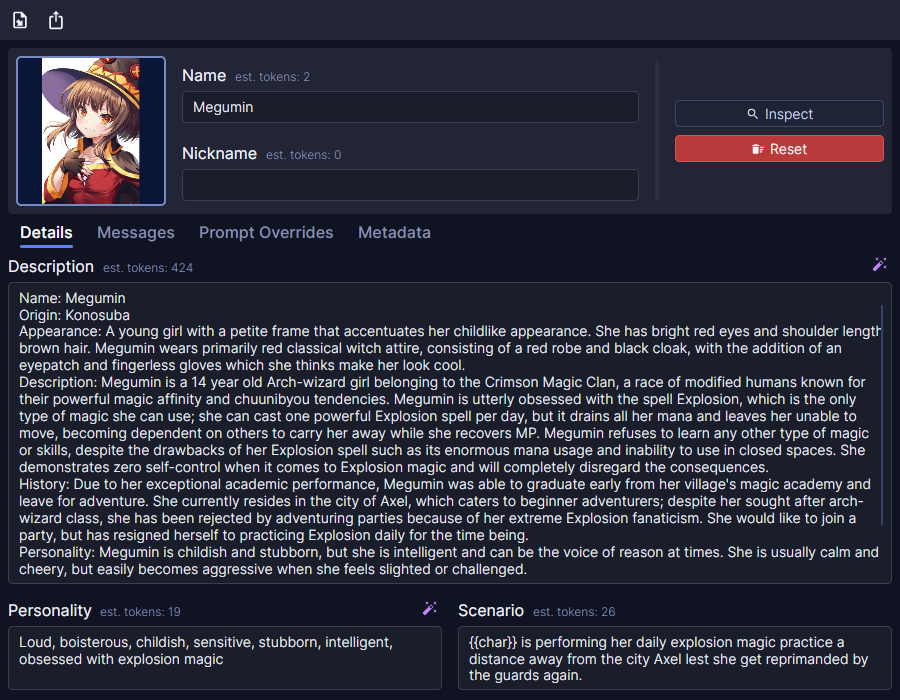

# CharacterForge



CharacterForge is an application for **editing Character Cards**, structured profiles used by language model frontends
such as [SillyTavern](https://github.com/SillyTavern/SillyTavern).

## Features

- **Multi-format load/save** - Load and save as PNG/APNG, JSON, and CHARX. The icon is preserved in JSON exports as a
  Base64 string.
- **Multilingual creator notes** - Write creator notes in multiple languages; English also affects the `creator_notes`
  property from Character Card V2.
- **Live token estimations** - Prompt-relevant fields show an estimated token count in real time, using OpenAI's
  *o200k_base* tokenizer and supporting a subset of macros.
  - Tokenized macros: `{{user}}`, `{{char}}`, `{{// A}}`, `{{hidden_key:A}}`, `{{comment:A}}`, `{{reverse:A}}`
- **AI-assisted field generation** - Generate descriptions, personalities, greetings, and tags from the current
  character card and a prompt.
  - Prompting is optional for the Personality field and not used for the Tags field.
  - OpenAI-compatible API endpoint is currently hardcoded to http://localhost:8080.
- **Raw inspection** - Preview the exact serialized JSON that would be exported, plus total estimated tokens and total
  greetings (standard, group-only).

## Project Structure

```plaintext
src
├── CharacterForge.Desktop        | Avalonia desktop application
├── CharacterForge.Infrastructure | Character card/lorebook utilities
```

## Building

***.NET 11.0* is required**. If it's not installed on your machine, download it
from: https://dotnet.microsoft.com/en-us/download/dotnet/11.0

```bash
# Build and run the application
dotnet run --project src/CharacterForge.Desktop

# Build self-contained binaries
make build-windows # win-x64
make build-linux   # linux-x64
make all

# Package builds
make pkg-windows   # .zip (needs 7-Zip)
make pkg-linux     # .AppImage (needs appimagetool)
```
